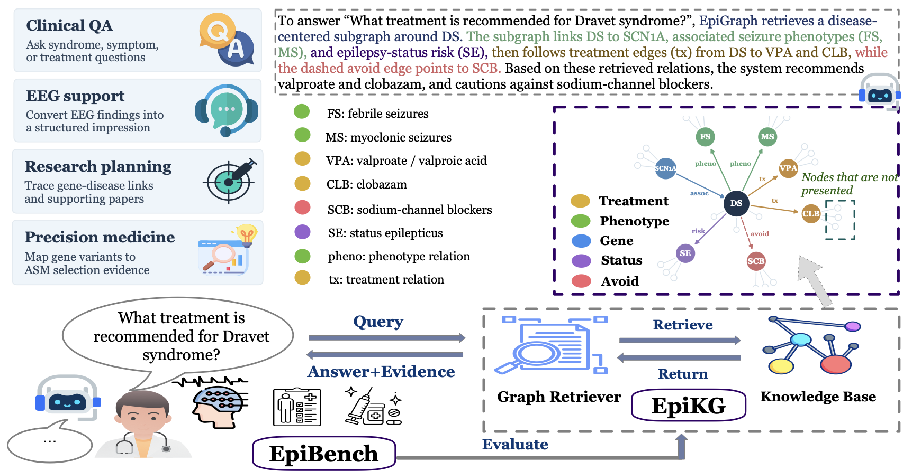
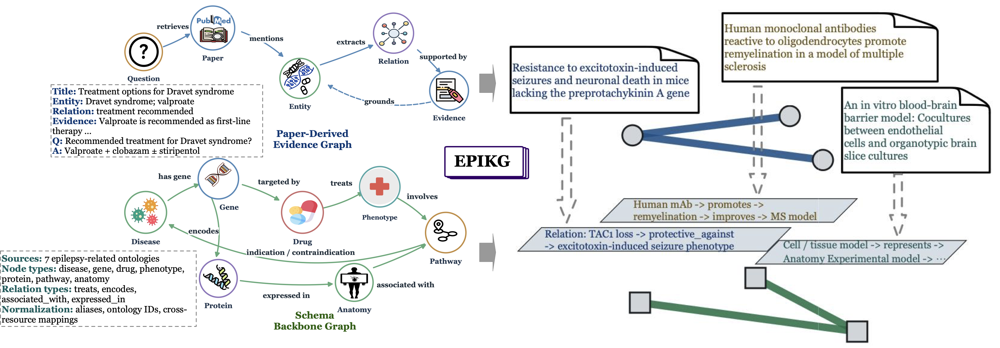
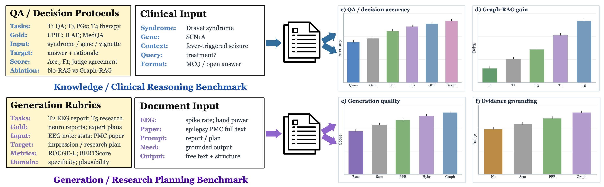

<div align="center">

# EpiGraph

### Building Generalists for Evidence-Intensive Epilepsy Reasoning in the Wild

**A knowledge-graph-powered benchmark and code release for evaluating whether AI systems can reason across epilepsy literature, EEG findings, genes, treatments, and clinical outcomes.**

<p>
  <a href="./docs"></a>
  <a href="https://arxiv.org/abs/2605.09505"></a>
  <a href="https://github.com/LabRAI/EpiGraph"></a>
  <a href="https://github.com/LabRAI/EpiGraph/releases"></a>
  <a href="./LICENSE"></a>
  
  
  
  
  
  
</p>

<p><a href="./docs"><b>EpiGraph Interactive Project Page</b></a> · <a href="https://arxiv.org/abs/2605.09505"><b>Paper: arXiv:2605.09505</b></a></p>

<h3>48,166 Papers · 24,324 Entities · 32,009 Triplets · 5 Evidence-Intensive Epilepsy Reasoning Tasks</h3>

<p>
  <a href="#how-to-cite">How to Cite</a> ·
  <a href="#news">News</a> ·
  <a href="#why-epigraph">Why EpiGraph</a> ·
  <a href="#key-features">Key Features</a> ·
  <a href="#quick-start">Quick Start</a> ·
  <a href="#epibench-tasks">Tasks</a> ·
  <a href="#repository-metrics">Metrics</a>
</p>

</div>

---

<p align="center">
  
</p>

## How To Cite

If you use EpiGraph, EpiKG, EpiBench, the Graph-RAG pipeline, or this code release, please cite the arXiv version:

```bibtex
@article{dai2026epigraph,
  title={EpiGraph: Building Generalists for Evidence-Intensive Epilepsy Reasoning in the Wild},
  author={Dai, Yuyang and Chen, Zheng and Pradeepkumar, Jathurshan and Matsubara, Yasuko and Sun, Jimeng and Sakurai, Yasushi and Dong, Yushun},
  journal={arXiv preprint arXiv:2605.09505},
  eprint={2605.09505},
  archivePrefix={arXiv},
  url={https://arxiv.org/abs/2605.09505},
  year={2026}
}
```

---

## News

- **2026-05-13** - EpiGraph is available on arXiv as [arXiv:2605.09505](https://arxiv.org/abs/2605.09505).
- **2026-05-13** - The project page now includes a responsive interactive KG explorer with search presets, node inspection, edge inspection, and mobile-friendly layouts.
- **2026-05-10** - The code release includes five paper-aligned EpiBench task runners, Graph-RAG retrieval, metrics, and a private-data-aware adapter for the Harvard EEG task.

---

## Why EpiGraph

Modern medical AI is moving from short-form question answering toward **evidence-intensive clinical reasoning**: connecting literature, mechanisms, phenotypes, EEG patterns, genetic biomarkers, treatment choices, safety constraints, and patient outcomes.

Epilepsy is a demanding testbed for this shift. Correct answers often depend on multi-hop evidence: a syndrome may be linked to a gene, the gene to a seizure phenotype, the phenotype to EEG signatures, and the treatment decision to contraindications or guideline evidence. **EpiGraph** makes these links explicit through an epilepsy knowledge graph and evaluates whether generalist models can use that evidence in realistic reasoning tasks.

This repository provides the paper-aligned code release for:

| Component | What it gives you |
|---|---|
| **EpiKG** | A lightweight builder for an epilepsy knowledge graph from literature and clinical resources |
| **Graph-RAG** | Retrieval over graph neighborhoods with PPR ranking and serialized reasoning paths |
| **EpiBench** | Five benchmark tasks spanning QA, EEG reports, precision medicine, treatment recommendation, and research planning |
| **Metrics** | Task-specific evaluation utilities aligned with the paper |
| **Project page** | A GitHub Pages-ready site with an interactive KG explorer and benchmark overview |

---

## Key Features

- **Large-scale epilepsy evidence graph**: EpiKG connects syndromes, phenotypes, genes, treatments, outcomes, and literature-backed evidence into a graph designed for multi-hop clinical reasoning.
- **Generalist-model benchmark**: EpiBench asks whether broad AI systems can handle epilepsy reasoning in the wild, not just answer short isolated medical questions.
- **Graph-RAG out of the box**: Retrieval combines personalized PageRank neighborhoods with serialized evidence paths so models can ground answers in graph structure.
- **Five clinically grounded tasks**: Evaluate clinical QA, EEG impression generation, biomarker precision medicine, treatment recommendation, and deep research planning.
- **Private-data-aware release**: Task 2 keeps the Harvard EEG data local while preserving the schema, build logic, and evaluation interface.
- **Interactive project page**: The included GitHub Pages site gives readers a searchable KG demo, task cards, visual overviews, and download links.

<table>
  <tr>
    <td width="50%">
      <h3>Interactive knowledge graph</h3>
      <p>Explore a compact EpiGraph subgraph directly in the browser. Search nodes, inspect evidence paths, and view relation metadata used by Graph-RAG.</p>
    </td>
    <td width="50%">
      <h3>Plug-and-play evaluation</h3>
      <p>Run the same task scripts with your own model, retriever, prompts, or local data exports. EpiBench is designed for fast model testing and fair ablation.</p>
    </td>
  </tr>
  <tr>
    <td width="50%">
      <h3>Five clinically grounded tasks</h3>
      <p>Evaluate models on epilepsy diagnosis, EEG impression generation, biomarker-driven medication selection, treatment recommendation, and deep research planning.</p>
    </td>
    <td width="50%">
      <h3>Private-data-aware release</h3>
      <p>The Harvard EEG task is supported through a local schema adapter, so the evaluation logic is reproducible without redistributing restricted data.</p>
    </td>
  </tr>
</table>

---

## Visual Tour

<p align="center">
  
</p>

**EpiKG** organizes epilepsy evidence into connected clinical layers, linking syndromes, phenotypes, genes, treatments, and outcomes through evidence-grounded triplets.

<p align="center">
  
</p>

**EpiBench** turns the graph and clinical inputs into five model-facing tasks, making it easy to compare standard prompting, retrieval, and Graph-RAG settings.

---

## At A Glance

| Signal | Scale in the paper |
|---|---:|
| Literature corpus | **48,166** papers |
| Knowledge graph entities | **24,324** entities |
| Knowledge graph triplets | **32,009** triplets |
| Benchmark tasks | **5** tasks |
| Core setting | Evidence-intensive epilepsy reasoning |

---

## Project Page

This repo includes a static GitHub Pages site in [`docs/`](./docs/). It contains:

| Page feature | Included |
|---|---|
| Responsive hero section | PC, laptop, tablet, and mobile friendly |
| Interactive KG explorer | Search, presets, clickable nodes, clickable edges, evidence inspector |
| EpiBench overview | Five task cards with metrics |
| Quick-start commands | Copy-ready evaluation command |
| Downloads | README, manifest, T2 schema, demo graph, license |

To publish the page on GitHub:

```text
Settings -> Pages -> Deploy from a branch
Branch: main
Folder: /docs
```

GitHub will then serve the page from the repository's Pages URL.

---

## Quick Start

```bash
git clone https://github.com/<your-org>/<your-repo>.git
cd <your-repo>
python -m venv .venv
source .venv/bin/activate
pip install -r requirements.txt
export OPENROUTER_API_KEY="your_key_here"
```

Run a Graph-RAG evaluation on Task 1:

```bash
python tasks/t1_clinical_decision_accuracy.py \
  --dataset data/epibench/t1/mcq.json \
  --triplets data/epikg/triplets.json \
  --model openai/gpt-4o \
  --mode graph_rag \
  --out runs/t1_mcq_graph_rag.json
```

For local models, replace the `ChatClient` implementation in [`epigraph/common.py`](../EpiGraph_code_release/epigraph/common.py) with your local inference wrapper or point it to an OpenAI-compatible local endpoint.

---

## Build A Lightweight EpiKG Preview

The full paper graph is built from 48,166 papers plus clinical resources. This release includes a reproducible preview builder for local PMC XML files:

```bash
python -m epigraph.build_kg \
  --pmc_dir /path/to/pmc_xml \
  --out_dir data/epikg
```

Expected outputs:

```text
data/epikg/triplets.json
data/epikg/paper_metadata.json
```

Triplets follow the paper-aligned schema:

```json
{
  "head": "SCN1A",
  "relation": "caused_by_gene",
  "tail": "Dravet syndrome",
  "head_layer": "gene",
  "tail_layer": "syndrome",
  "paper_count": 12,
  "paper_ids": ["pmc_..."]
}
```

---

## EpiBench Tasks

| Task | Name | What it measures | Main metrics |
|---|---|---|---|
| **T1** | Clinical Decision Accuracy | Epilepsy-specific MCQ and open-ended clinical QA | Top-1 accuracy, BLEU-1, ROUGE-L, Token-F1 |
| **T2** | Clinical Report Generation | EEG description and patient context to neurologist-style impression | ROUGE-L, Token-F1, report alignment |
| **T3** | Biomarker Precision Medicine | Gene variant and phenotype to antiseizure medication selection | Top-1 accuracy, drug safety score |
| **T4** | Treatment Recommendation | Guideline-consistent therapy choice under patient-specific constraints | Top-1 accuracy, drug safety, KG evidence coverage |
| **T5** | Deep Research Planning | Literature-grounded research question and feasible study-plan generation | ROUGE-L, Token-F1, LLM-as-judge dimensions |

### T1 Clinical Decision Accuracy

```bash
python tasks/t1_clinical_decision_accuracy.py \
  --dataset data/epibench/t1/mcq.json \
  --triplets data/epikg/triplets.json \
  --model openai/gpt-4o \
  --mode graph_rag \
  --out runs/t1_mcq_graph_rag.json
```

### T2 Clinical Report Generation

The Harvard EEG data used by the paper cannot be redistributed. This release provides a local adapter and evaluator. Prepare a private JSONL export with the following fields:

```json
{"patient_history":"...","eeg_description":"...","bandpower":{"delta":0.31},"spike_rate":2.4,"impression":"..."}
```

Then build and evaluate:

```bash
python tasks/t2_clinical_report_generation.py build \
  --raw_jsonl data/private/harvard_eeg/local_export.jsonl \
  --out data/epibench/t2/harvard_preview.json

python tasks/t2_clinical_report_generation.py eval \
  --dataset data/epibench/t2/harvard_preview.json \
  --triplets data/epikg/triplets.json \
  --model medgemma-4b-it \
  --mode graph_rag
```

### T3 Biomarker-Driven Precision Medicine

```bash
python tasks/t3_biomarker_precision_medicine.py build \
  --out data/epibench/t3/bpm_mcq.json

python tasks/t3_biomarker_precision_medicine.py eval \
  --dataset data/epibench/t3/bpm_mcq.json \
  --triplets data/epikg/triplets.json \
  --model openai/gpt-4o \
  --mode graph_rag
```

### T4 Treatment Recommendation

```bash
python tasks/t4_treatment_recommendation.py build \
  --out data/epibench/t4/medqa_epilepsy.json \
  --max_items 200

python tasks/t4_treatment_recommendation.py eval \
  --dataset data/epibench/t4/medqa_epilepsy.json \
  --triplets data/epikg/triplets.json \
  --model openai/gpt-4o \
  --mode graph_rag
```

### T5 Deep Research Planning

```bash
python tasks/t5_deep_research_planning.py build \
  --lay_summaries data/epibench/t5/lay_summaries.json \
  --out data/epibench/t5/research_planning.json

python tasks/t5_deep_research_planning.py eval \
  --dataset data/epibench/t5/research_planning.json \
  --triplets data/epikg/triplets.json \
  --model openai/gpt-4o \
  --mode graph_rag
```

---

## Repository Layout

```text
EpiGraph_code_release/
  configs/default.json
  docs/
    index.html
    styles.css
    app.js
    data/demo_graph.json
  epigraph/
    build_kg.py
    common.py
    metrics.py
    retrieval.py
  tasks/
    t1_clinical_decision_accuracy.py
    t2_clinical_report_generation.py
    t3_biomarker_precision_medicine.py
    t4_treatment_recommendation.py
    t5_deep_research_planning.py
  CODE_MANIFEST.md
  LICENSE
  README.md
  requirements.txt
```

---

## License

This project is released under the [Apache License 2.0](../EpiGraph_code_release/LICENSE).

---

## Repository Metrics

<div align="center">

<a href="https://github.com/LabRAI/EpiGraph/stargazers"></a>
<a href="https://github.com/LabRAI/EpiGraph/network/members"></a>
<a href="https://github.com/LabRAI/EpiGraph/watchers"></a>
<a href="https://github.com/LabRAI/EpiGraph/releases"></a>
<a href="https://github.com/LabRAI/EpiGraph/issues"></a>


</div>

<p align="center">
  <a href="https://star-history.com/#LabRAI/EpiGraph&Date">
    
  </a>
</p>

---

<div align="center">

**EpiGraph turns epilepsy evidence into graph structure, then tests whether generalist AI systems can reason with it.**

</div>
